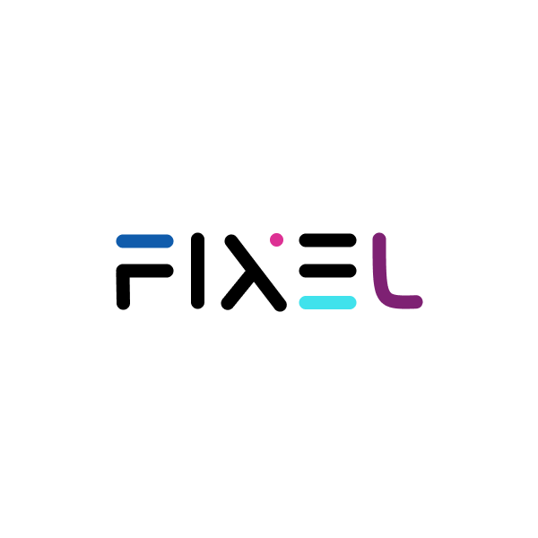

<h1 align="center">

  FIXEL (Ai App to Increse Photo Resolution)
   
</h1>

<h4 align="center">
A Deep learning project which targets improving the camera quality for budget phones, the Fixel app provides the user capability to capture images through the Fixel App made of Ionic and sent captured image to web API. The Fixel Web Api Is bundled with ProSR GAN for converting low-resolution images to high-resolution images.</h4>

## Componets
- [Fixel Ionic App](https://github.com/antonyjm462/Fixel)
- [Fixel Django Server](https://github.com/antonyjm462/FixelServer)
- [Fixel Api](https://github.com/antonyjm462/FixelAPI)

 
 
  
## Key Features

* Ionic App to Take Photo and sent to database as induvidual or Group
* Fixel Api to Take care of the database writes
* Fixel Server Which includes  ProSR GAN to convert low resplotion images to higher resolution.
* Uses Base64 encoding to send and recive data.
* Includes a Home page for user to view images.

## Getting Started

FIXEL is made with Ionic framework and the database of the project is deployed in Firebase.

## Platforms
* Android
* Web

## Login
The Login can be done by  using the email of the user after registration.

## Home
Where user can take photos which can be uploaded into database easily with a click, The images which will be stored in a Database in the device will be converted into base 64 Format will be uploaded into the database by using the Fixel Api and the converted images will be automatically downloaded.

## Gallery

The Componet will Contineuosly Check the Ap for any Changes IF any Changes is present It Will download the Data and images will be shown here.

## Api

The Fixel Api is implemented using google cloud Functions. its mainly used to track the user and to update values in database and automatically download the converted files back to the App.the images are converted into the base 64 format for senting thorugh the Api
the data is stored in the database which is then take up by the sever to convert the files.

## Django Server
the Django server is implemented so that it can house thee proSR GAN Deep Learning Model Which Converts the lower Resolution Images to HIgher Resolution.
The Server Takes the Data stored in the database using the Fixel Api itself and then decodes the Base 64 Format to feed to the model after processing the Image is again converted into the Base 64 Format then Updated in the Database.

## Built With

* [Ionic](https://angular.io/start) - The web framework used
* [Firebase](https://firebase.google.com/) - Database Management
* [HTML & CSS](https://www.w3schools.com/html/html_css.asp) - Front End Development
* [Django](https://firebase.google.com/) - Sever and DL implementation
* [Cloud Functions](https://www.w3schools.com/html/html_css.asp) - Api 

## Contributing

Anyone interested in contributing to the project , please give a pull request.

## License

This project is licensed under the MIT License 

